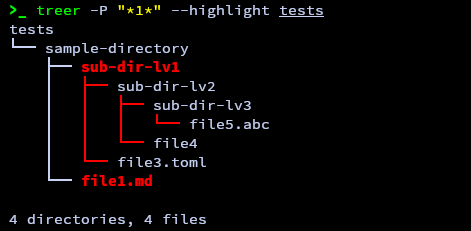

# Treer

Another version of the tree command with some additional tweaks to better support recursive searching:

- [x] Display only directories that match some wild-card patterns and reveal all their contents.
- [x] Highlight all matching directory names and all prefixes of their subdirectories.




## Installation

- **Prequisite:** Rust and Cargo installed

- **Install:**
  - From git repo

    ```sh
    git clone https://github.com/anhtr13/treer
    cd treer
    cargo install --path .
    ```

  - Or via cargo

    ```sh
    cargo install treer
    ```

## Usage

```sh
  treer [OPTIONS] [PATH]
```

**Arguments:**

[PATH]: Path to the directory. [default: .]

**Options:**

| Short | Long                | Description                                                                                        |
| ----- | ------------------- | -------------------------------------------------------------------------------------------------- |
| -a    | --all               | Include hidden directories.                                                                        |
| -A    | --ascii             | Use ascii characters to indent.                                                                    |
| -d    | --directories       | List directories only.                                                                             |
| -D    | --date              | Print last modification date.                                                                      |
| -f    | --full              | Print full path prefix.                                                                            |
| -L    | --level <LEVEL>     | Descend only level directories deep.                                                               |
| -i    | --no-indent         | Disable indentation.                                                                               |
| -I    | --exclude <EXCLUDE> | Ignore directories that match some wild-card patterns. May have multiple -I.                       |
| -s    | --size              | Print file size.                                                                                   |
| -p    | --permissions       | Print permissions.                                                                                 |
| -P    | --pattern <PATTERN> | List only directories that match some wild-card patterns and their contents. May have multiple -P. |
| -t    | --sort-by-time      | Sort by last modification time.                                                                    |
| -h    | --help              | Print help.                                                                                        |
